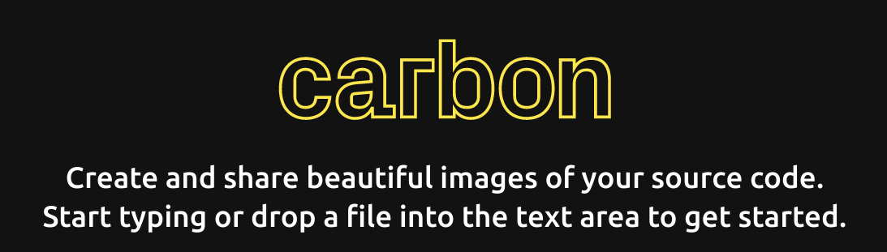
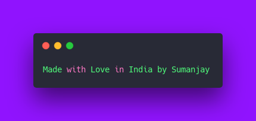

# Carbon API [Unofficial]
---
<p align="center">
    <a href="https://github.com/carbon-app/carbon">
        
    </a>
    <br>
    <b>Unofficial API</b>
    <br>
</p>

### Show some :heart: and :star: the repo

[](https://github.com/cyberboysumanjay/JioSaavnAPI)

[](https://t.me/sjprojects)

## Carbon API written in Python using Flask and Pyppeteer
[](https://www.python.org/) [](https://github.com/ellerbrock/open-source-badges/)

> **Carbon**  makes it easy to create and share beautiful images of your source code

#### Usage
You can use the API by sending a GET or a POST request using these params

| parameter              | default                    | type    | description                                      |
| ---------------------- | -------------------------- | ------- | ------------------------------------------------ |
| `code` (required)      |                            | string  | Code snippet                                     |
| `backgroundColor`      | `"rgba(171, 184, 195, 1)"` | string  | Hex or rgba color                                |
| `dropShadow`           | `true`                     | boolean | Turn on/off shadow                               |
| `dropShadowBlurRadius` | `"68px"`                   | string  | shadow blur radius                               |
| `dropShadowOffsetY`    | `"20px"`                   | string  | shadow offset y                                  |
| `exportSize`           | `"2x"`                     | string  | resolution of exported image, e.g. `1x`, `3x`    |
| `fontSize`             | `"14px"`                   | string  | font size                                        |
| `fontFamily`           | `"Hack"`                   | string  | font family, e.g. `JetBrains Mono`, `Fira Code`. |
| `firstLineNumber`      | `1`                        | number  | first line number                                |
| `language`             | `"auto"`                   | string  | programing language for properly highlighting    |
| `lineNumbers`          | `false`                    | boolean | turn on/off line number                          |
| `paddingHorizontal`    | `"56px"`                   | string  | horizontal padding                               |
| `paddingVertical`      | `"56px"`                   | string  | vertical padding                                 |
| `theme`                | `"seti"`                   | string  | code theme                                       |
| `watermark`            | `false`                    | boolean | turn on/off watermark                            |
| `widthAdjustment`      | `true`                     | boolean | turn on/off width adjustment                     |
| `windowControls`       | `true`                     | boolean | turn on/off window controls                      |
| `windowTheme`          | `"none"`                   | string  | window theme                                     |

### GET `/`
Params are encoded in url
```bash
https://carbonnowsh.herokuapp.com/?code=Made+with+Love+in+India+by+Sumanjay&theme=darcula&backgroundColor=rgba(144, 19, 254, 100)
```

### POST `/`

**Body** is JSON with these params:

```json
{
    "backgroundColor": "rgba(144, 19, 254, 100)",
    "code": "Made with Love in India by Sumanjay",
    "theme": "dracula"
}
```

### RESPONSE
**Response** is an image of a code or text snippet.
<p align="center">
    <a href="https://github.com/cyberboysumanjay">
        
    </a>
</p>

#### Deploy Option

* **[Heroku](https://www.heroku.com/) Method** 
  [](https://heroku.com/deploy?template=https://github.com/cyberboysumanjay/Carbon-API/tree/master)

* **Other Method** 

  ```bash
  # Clone the repo
  git clone https://github.com/cyberboysumanjay/Carbon-API
  cd Carbon-API

  # Create virtualenv
  virtualenv -p /usr/bin/python3 venv
  ../venv/bin/activate

  # Install requirements
  pip3 install -r requirements.txt

  # Finally run the app
  python3 app.py
  ```
### Made with ❤️️ in India
### Copyright & License 

* Copyright (C) 2020 by [Sumanjay](https://github.com/cyberboysumanjay)
* Licensed under the terms of the [GNU GPL Version 3](https://github.com/cyberboysumanjay/Carbon-API/blob/master/LICENSE)
